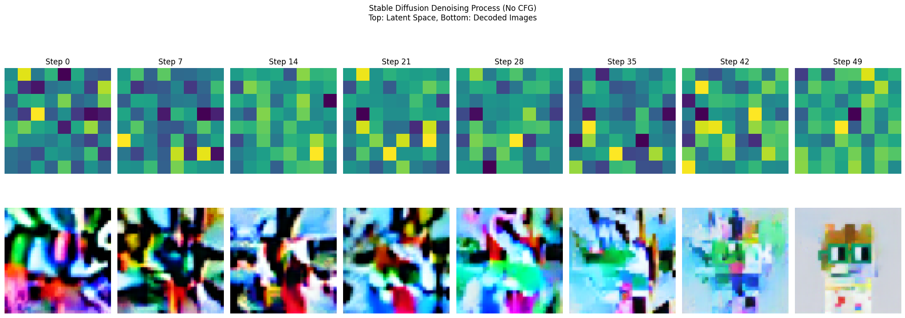

# Stable_Diffusion_Trainer: Text to Image Stable Diffusion model(train from scratch or finetune from a checkpoint)
Contain a single script to train stable diffusion from scratch. Easy to modify with advanced library support. This script was modified from an unconditional image generation script from diffusers. 

## Key Features

- Custom UNet and VAE architecture
- Resume from checkpoints
- Can be used to finetune
- EMA (Exponential Moving Average) for model stability
- Mixed precision training support
- Integration with TensorBoard and Weights & Biases
- HuggingFace Hub compatibility
- Multi GPU support
- Mixed precision support with accelerate


## Usage
Cloning Repo
```bash
!git clone https://github.com/KetanMann/Stable_Diffusion_Trainer
```
```bash
cd Stable_Diffusion_Trainer
```
1. Install dependencies:
```bash
pip install -r requirements.txt
```
and source install of diffusers
```bash
pip install git+https://github.com/huggingface/diffusers 
```
2. Prepare your dataset
See dataset dataloader documentation from huggingface
You can use local file or some dataset at hugging face hub.(See below implementation)

3. Run the training script:

```bash
!accelerate launch --multi_gpu stable_diffusion_script.py \
  --dataset_name="m1guelpf/nouns" \ #Yours Dataset name or local dataset path
  --resolution=64 \
  --output_dir=/kaggle/working/nouns_models \
  --train_batch_size=32 \
  --dataloader_num_workers=4 \
  --eval_batch_size=1 \
  --num_epochs=20000000 \
  --use_ema \
  --gradient_accumulation_steps=4 \
  --learning_rate=3e-5 \
  --lr_warmup_steps=2000 \
  --mixed_precision="no" \
  --save_images_epoch=1 \
  --ddpm_beta_schedule="squaredcos_cap_v2" \
  --checkpointing_steps=500 \
  --resume_from_checkpoint="latest" \
  --prediction_type="v_prediction" \
#  --logger="wandb" \
  --image_column="image" \
  --caption_column="text" \
  --ddpm_num_inference_steps=999

```
## Some sampling information:- 
I trained an SD model to generate 64x64 images from 8x8 noisy latents. Here is the denoising process and corresponding latent space images.

